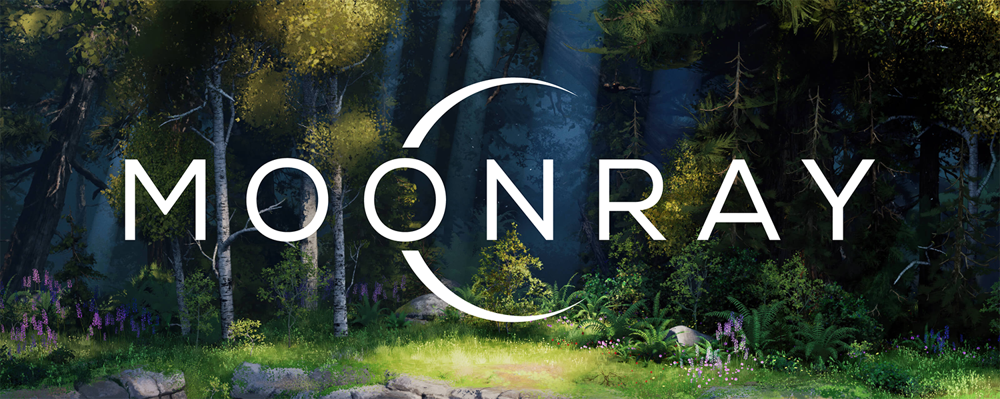

[Website](https://openmoonray.org) | [Discussion Forum](https://github.com/dreamworksanimation/openmoonray/discussions) | [Documentation](https://docs.openmoonray.org/) | [Releases](https://github.com/dreamworksanimation/openmoonray/releases) | [License](https://www.apache.org/licenses/LICENSE-2.0)

MoonRay is an open source, production path-tracing renderer, that efficiently renders images for animation, visual effects and other uses.  MoonRay supports industry standards and libraries and was open sourced by DreamWorks, where it is in active use for their [feature film animation](https://openmoonray.org/documentation) pipeline. With MoonRay, you can take advantage of an extensive library of production-tested, physically based materials, a USD Hydra render delegate, and local, multi-machine and cloud rendering for interactive and batch rendering. It runs on CPU and hybrid GPU (XPU) hardware and offers tools for [regression testing](https://github.com/dreamworksanimation/rats), [performance monitoring](https://docs.openmoonray.org/user-reference/tools/render-profile-viewer/) and [more](https://docs.openmoonray.org/user-reference/tools/).

### License

MoonRay is released under the [Apache License, Version 2.0](LICENSE), which is a free, open source software license developed and maintained by the Apache Software Foundation.

### Contributions

MoonRay welcomes contributions to the project. Please refer to the [Contribution Guidelines](CONTRIBUTING.md) for details on how to make a contribution.

### Cloning

This is the top-level repository for the MoonRay project. The actual source code is contained in a number of other repositories referenced here as git submodules.

To clone this repository along with the submodules:

```git clone --recurse-submodules https://github.com/dreamworksanimation/openmoonray.git```

### Build and Run

You can get started building MoonRay on Linux or MacOS, or a container by reading the [Building MoonRay](https://docs.openmoonray.org/getting-started/installation/building-moonray/) documentatation website.


### Developer Quick Start

A helpful start will be at understanding the [structure of the source code](https://docs.openmoonray.org/developer-reference/source-structure/), followed by the overall [Developer's Guide](https://docs.openmoonray.org/developer-reference/).
